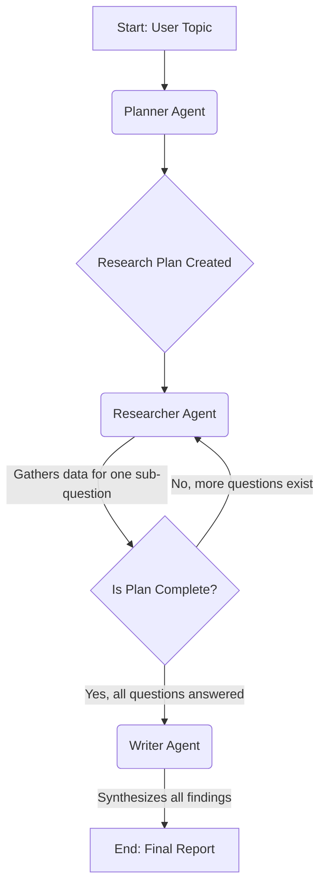

# AI-Powered Deep Research Agentic System
### Kairon Qualifying Assignment Submission

## 1. Introduction

This project is a sophisticated, multi-agent AI system designed to perform deep research on any given topic. The system takes a high-level topic, autonomously creates a research plan, gathers information from the internet, and synthesizes the findings into a comprehensive, well-structured report.

This solution was built for the Kairon qualifying assignment, demonstrating proficiency in modern AI engineering frameworks like **LangChain & LangGraph**, agentic design principles, and the integration of external tools for robust information gathering.

The core of this project is its agentic workflow, where specialized AI agents collaborate to achieve a complex goal, mirroring a real-world human research team.

## 2. System Architecture & Workflow

The system is architected as a **cyclical, stateful graph** using the LangGraph framework. This is more powerful than a simple chain as it allows for loops, conditional logic, and a persistent state that is passed between agents.

The `ResearchState` object acts as the shared memory for the agents, containing the topic, the evolving research plan, the collected answers, and the final report.

**The agentic workflow consists of the following nodes:**

1.  **Planner Agent**: The "Team Lead." Upon receiving the user's topic, this agent's sole responsibility is to break it down into a logical, step-by-step list of sub-questions. This forms the research plan, ensuring comprehensive and structured data collection.

2.  **Researcher Agent**: The "Data Collector." This agent works in a loop, taking one sub-question at a time from the plan. It has access to two critical tools:
    -   **Tavily Search Tool**: To perform targeted web searches for the most relevant articles, papers, and sources.
    -   **Web Scraper Tool**: To read the full text content of the most promising URLs returned by the search.
    It then synthesizes the information from these sources to generate a factual answer for that *specific* sub-question.

3.  **Conditional Edge (Decision Point)**: After each research step, the graph's logic checks if the number of researched answers matches the number of questions in the plan.
    -   **If NO**, the graph loops back to the Researcher Agent, feeding it the next question.
    -   **If YES**, the research phase is complete, and the graph proceeds to the final writing phase.

4.  **Writer Agent**: The "Report Drafter." This agent receives the complete, structured set of all questions and their corresponding researched answers. Its job is not to find new information, but to weave the existing findings into a single, coherent, and well-formatted final report, complete with an introduction, body, and conclusion.

### Workflow Diagram

## 3. Core Technologies & Components

- **Primary Frameworks**: **LangChain** (for agent components and tools), **LangGraph** (for orchestrating the multi-agent workflow).
- **Language Model (LLM)**: **Google Gemini (`gemini-1.5-flash-latest`)** accessed via the `langchain-google-genai` library, providing a powerful and free-tier-friendly reasoning engine.
- **User Interface**: **Streamlit**, for creating a simple, interactive web-based front-end.
- **Online Search Tool**: **Tavily AI**, integrated via `langchain-community` for fast, accurate, and AI-optimized search results.
- **Web Scraping**: **BeautifulSoup4** & **Requests**, built into a custom LangChain tool for on-demand content extraction.
- **Environment Management**: **`python-dotenv`** for securely managing API keys without hard-coding them.

Streamlit app : https://kairon-qualifying-assignment-xps64prcu7q54nnnac5zft.streamlit.app/
